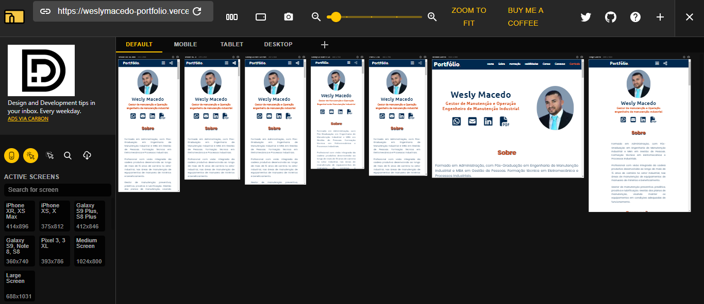

# Website Portfolio | 

Project: Portfolio Website (freelance project) for the Maintenance and Operation Industrial Manager Wesly Macedo.
 
"Mobile First" project developed with HTML, CSS and JavaScript. Responsive page for screen sizes: 320px, 375px, 425px, 768px and 1024px. Important features: Dropdown menu (hamburger) and "share" button for sharing the site (For smartphone screens).
 
As a highlight, the knowledge applied was: Responsiveness, JavaScript functions, classList property, toggle method, onclick attribute in HTML, semantic HTML and CSS properties. 

## Table of contents

- [Overview](#overview)
  - [The challenge](#the-challenge)
  - [Screenshot](#screenshot)
  - [Links](#links)
- [My process](#my-process)
  - [Built with](#built-with)
- [Author](#author)

## Overview

### The challenge

Users should be able to:

- View the optimal layout for the site depending on their device's screen size (Developed for the breakpoints: 320px, 375px, 425px, 768px and 1024px)
- See hover states for all interactive elements on the page
- Manipulate the dropdown menus (Hamburger menu for smartphones)
- Send the website portfolio through the button share (For smartphones screen size)

### Screenshot

#### Responsive Viewer

### Links

- [Solution URL here](https://github.com/renato-albuquerque/wm-portfolio)
- [Live Site URL here](https://weslymacedo-portfolio.vercel.app/)

## My process

### Built with

- Semantic HTML5 markup
- CSS custom properties
- Flexbox
- JavaScript
- Mobile-first workflow

## Author

- Business Card - [Renato Albuquerque](https://rma-contacts.vercel.app/)
- Linkedin - [renato-malbuquerque](https://www.linkedin.com/in/renato-malbuquerque/)
- Discord - [Renato Albuquerque#0025](https://discordapp.com/users/992621595547938837)